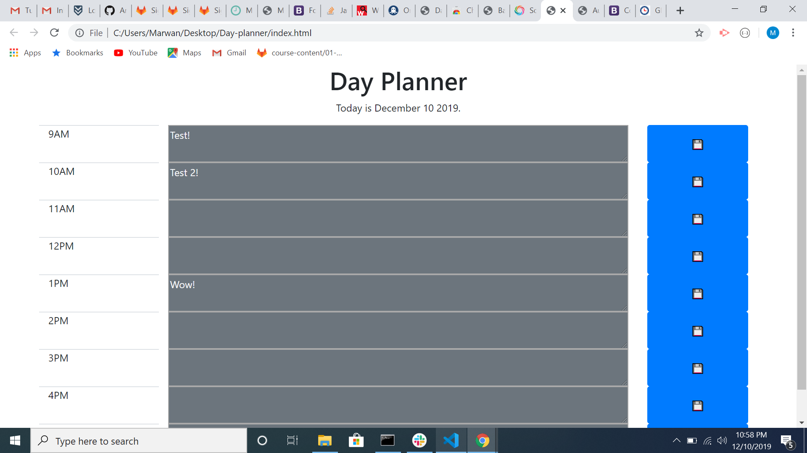

# Day-planner
In this Day planner you will be able to save your to do list in the table, and organize your work.
I used moments.js to have a date that updates automaticly everyday, added a function to save text, and the row will change color depending on the time of day

I couldnt add more because of the current time 

# Prerequisites
No prerequistes 

# Installing
Copy files and open with browser
check code with VS or inspect using the browser

# Built With
Bootstrap 
Java 
HTML
Github pages

# Authors
Marwan Jassim

# License
This project is licensed under the MIT License
https://github.com/marwanjassim/password-generator.git